<picture>
  <source media="(prefers-color-scheme: dark)" srcset="assets/signal-system-dark.svg">
  <source media="(prefers-color-scheme: light)" srcset="assets/signal-system-light.svg">
  
</picture>

# Harsh Saand

**AI engineer · MSc Artificial Intelligence candidate at NTU Singapore**

I like AI most when it crosses disciplines: process physics becomes a fast design tool, a wafer image becomes an inspectable review signal, or a multilingual recording becomes useful without leaving the machine. I build these systems from mechanism to evidence to interface, then document where they stop being reliable.

[Email](mailto:harshsaand@yahoo.com) · [LinkedIn](https://www.linkedin.com/in/harsh-saand-961228230) · [Start a technical conversation](https://github.com/HarshSaand/HarshSaand/issues/new?title=Technical%20conversation%3A%20&body=Hi%20Harsh%2C%0A%0AI%20was%20looking%20at%20...)

### Follow a signal

[Semiconductor intelligence](#semiconductor-intelligence) · [Speech and language](#speech-and-language) · [Vision and multimodal AI](#vision-and-multimodal-ai) · [Evaluation and trust](#evaluation-and-trust)

---

## The map

<a id="semiconductor-intelligence"></a>

**Semiconductor intelligence**

Physics-guided learning, wafer-map understanding, surrogate modelling, uncertainty, and engineer-facing evidence.

<a id="speech-and-language"></a>

**Speech and language**

Local multilingual transcription, translation, diarization, retrieval, and privacy-conscious pipelines.

<a id="vision-and-multimodal-ai"></a>

**Vision and multimodal AI**

Computer vision, synthetic-media analysis, 3D reconstruction, diffusion models, and evidence fusion.

<a id="evaluation-and-trust"></a>

**Evaluation and trust**

Grouped splits, calibration, abstention, distribution-shift awareness, provenance, and claims that match the evidence.

## Latest from the lab

This section refreshes automatically from my latest substantial public repositories. A new project with a clear GitHub description joins the feed after its first push.

<!-- RECENT_WORK:START -->
**[LithoTwin AI TCAD](https://github.com/HarshSaand/lithotwin-ai-tcad)**<br>
Conditional neural surrogate for computational lithography and resist-contour prediction.<br>
<sub>Python / Aug 2026</sub>

**[Local Multilingual Speech Intelligence](https://github.com/HarshSaand/local-multilingual-speech-intelligence)**<br>
Privacy-conscious local multilingual transcription, translation and optional speaker diarization with structured exports.<br>
<sub>Python / local ai / multilingual / Aug 2026</sub>

**[ProcessTwin AI TCAD](https://github.com/HarshSaand/processtwin-ai-tcad)**<br>
Physics-grounded surrogate modelling for silicon oxidation, dopant diffusion, uncertainty and inverse process design.<br>
<sub>Python / inverse design / physics informed ml / Aug 2026</sub>

**[Multi-Agent Tileworld](https://github.com/HarshSaand/Multi-Agent-Tile-PJ)**<br>
Cooperative Tileworld agents using A*, shared working memory, broadcasts, complementary patrols and fuel-aware planning.<br>
<sub>Java / a star / cooperative ai / Aug 2026</sub>

**[Wafer Process Signature Triage](https://github.com/HarshSaand/wafer-process-signature-triage)**<br>
Interpretable wafer-map classification with spatial signatures, calibrated confidence and similar-case retrieval.<br>
<sub>Python / anomaly triage / computer vision / Aug 2026</sub>

**[DeepShield ApprovalGuard](https://github.com/HarshSaand/deepshield-approvalguard)**<br>
Local multimodal media-integrity review prototype for sensitive financial instructions, with human escalation and abstention.<br>
<sub>Python / audio antispoofing / deepfake detection / Aug 2026</sub>
<!-- RECENT_WORK:END -->

## Four systems worth opening

These are not the limits of what I build. They are the clearest examples of how I think.

<details open>
<summary><b>ProcessTwin AI TCAD</b> | physics-guided semiconductor modelling</summary>

[Open repository](https://github.com/HarshSaand/processtwin-ai-tcad)

Can reduced-order silicon process physics and a learned surrogate support fast recipe exploration without hiding what the model approximates?

`recipe → reduced-order physics → simulated DOE → PCA + residual ensemble → inverse search → solver verification`

- Built Deal-Grove oxidation, 1D dopant diffusion, a deterministic 6,000-recipe simulated DOE, PCA profile compression, residual MLP ensembles, OOD warnings, and simulator-verified inverse design.
- Held-out simulator fidelity reached R² 0.9968 for oxide thickness and 0.9985 for junction depth. These are simulator-backed results, not fab calibration.
- [Inspect the source](https://github.com/HarshSaand/processtwin-ai-tcad/tree/main/src/processtwin), [saved metrics](https://github.com/HarshSaand/processtwin-ai-tcad/blob/main/outputs/metrics.json), [tests](https://github.com/HarshSaand/processtwin-ai-tcad/tree/main/tests), or the [technical report](https://github.com/HarshSaand/processtwin-ai-tcad/blob/main/outputs/processtwin_report.pdf).

</details>

<details>
<summary><b>Wafer Process Signature Triage</b> | spatial evidence for engineering review</summary>

[Open repository](https://github.com/HarshSaand/wafer-process-signature-triage)

Can wafer-map geometry become a useful review signal while keeping spatial structure visible to an engineer?

`wafer image → grouped split → Cartesian and polar views → calibrated ranking → review route + similar cases`

- Fused Cartesian and polar CNN views with a 17-value spatial signature, grouped splitting, temperature calibration, uncertainty routing, and similar-case retrieval.
- The saved seed-42 run reached 0.812 macro-F1 on an untouched 138-image grouped test split across nine classes.
- This is pattern triage, not causal root-cause diagnosis. [Inspect provenance](https://github.com/HarshSaand/wafer-process-signature-triage/blob/main/DATA_PROVENANCE.md), [source](https://github.com/HarshSaand/wafer-process-signature-triage/tree/main/src/wafer_tcad), [metrics](https://github.com/HarshSaand/wafer-process-signature-triage/blob/main/outputs/metrics.json), or [tests](https://github.com/HarshSaand/wafer-process-signature-triage/tree/main/tests).

</details>

<details>
<summary><b>DeepShield ApprovalGuard</b> | multimodal integrity evidence</summary>

[Open repository](https://github.com/HarshSaand/deepshield-approvalguard)

Before a sensitive financial instruction moves forward, can local AI surface media-integrity evidence that deserves human review?

`recording → quality checks → independent evidence branches → timestamped timeline → review route`

- Combined synthetic-voice, face-manipulation, visual-continuity, media-quality, and audio-video timing branches with timestamped evidence and abstention.
- The AASIST audio branch reached ROC-AUC 0.9078 on a balanced 570-file ASVspoof subset. Other branches use functional fixtures and are not presented as validated detectors.
- The system supports review; it does not establish identity, intent, or fraud. [Inspect the pipeline](https://github.com/HarshSaand/deepshield-approvalguard/tree/main/approvalguard), [evaluation](https://github.com/HarshSaand/deepshield-approvalguard/tree/main/evaluation), [dataset card](https://github.com/HarshSaand/deepshield-approvalguard/blob/main/DATASET_CARD.md), or [model provenance](https://github.com/HarshSaand/deepshield-approvalguard/blob/main/THIRD_PARTY_MODELS.md).

</details>

<details>
<summary><b>Local Multilingual Speech Intelligence</b> | private speech pipelines</summary>

[Open repository](https://github.com/HarshSaand/local-multilingual-speech-intelligence)

How can multilingual recordings be transcribed, translated, speaker-labelled, and reviewed while keeping audio processing local?

`local media → VAD + faster-whisper → optional diarization → overlap assignment → TXT / JSON / HTML`

- Built a compact `faster-whisper` pipeline with optional `pyannote.audio` diarization, temporal-overlap speaker assignment, and accessible exports.
- The repository includes synthetic data and deterministic tests for timestamps, speaker overlap, JSON preservation, and HTML escaping. It is a reference pipeline, not a claimed speech-quality benchmark.
- [Inspect the source](https://github.com/HarshSaand/local-multilingual-speech-intelligence/blob/main/local_speech_intelligence.py), [synthetic output](https://github.com/HarshSaand/local-multilingual-speech-intelligence/blob/main/examples/synthetic-transcript.json), or [tests](https://github.com/HarshSaand/local-multilingual-speech-intelligence/tree/main/tests).

</details>

## How I think

```text
find the failure mode
        ↓
build the smallest measurable system
        ↓
inspect errors and distribution shifts
        ↓
state what the result does not prove
        ↓
design the path to use
```

**Mechanism before mystique.** I want to know what produces an output and where the abstraction breaks.

**Evaluation before adjectives.** A metric needs a dataset, protocol, baseline, and honest boundary around it.

**Privacy is architecture.** Data handling and deployment constraints shape a system from the beginning.

**Interfaces are part of the model.** Evidence matters when another person can inspect it and make a better decision.

<details>
<summary><b>More experiments and earlier builds</b></summary>

My broader work includes [multi-agent Tileworld](https://github.com/HarshSaand/Multi-Agent-Tile-PJ), retrieval-augmented generation, diffusion style transfer, disaster-tweet classification, and geometric 3D reconstruction. Some are compact experiments; others grew into the systems above.

</details>

## Questions I want to keep chasing

- How can mechanistic models and learned surrogates work together with uncertainty that is actually calibrated?
- How should multimodal integrity systems behave under distribution shift, missing evidence, and deliberate attack?
- How can multilingual speech systems remain private, inspectable, and useful on constrained hardware?

## Technical working set

```text
Learning systems   PyTorch, Transformers, RAG, LoRA/PEFT, model evaluation
Speech and NLP     faster-whisper, WhisperX, pyannote, multilingual translation
Vision             CNNs, diffusion models, geometric vision, 3D reconstruction
Engineering        Python, Java, REST APIs, Docker, Kubernetes, GPU computing
```

## Let’s compare notes

I am open to internships and early-career roles in applied AI/ML and research engineering, especially in semiconductor intelligence, speech and NLP, computer vision, multimodal systems, and trustworthy evaluation.

If our questions overlap, [email me](mailto:harshsaand@yahoo.com), [connect on LinkedIn](https://www.linkedin.com/in/harsh-saand-961228230), or [start a technical conversation](https://github.com/HarshSaand/HarshSaand/issues/new?title=Technical%20conversation%3A%20&body=Hi%20Harsh%2C%0A%0AI%20was%20looking%20at%20...).
