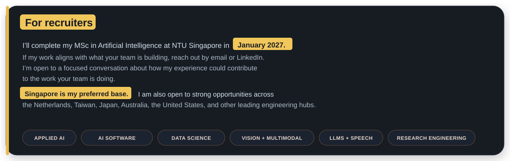

<picture>
  <source media="(prefers-color-scheme: dark)" srcset="assets/signal-system-dark.svg">
  <source media="(prefers-color-scheme: light)" srcset="assets/signal-system-light.svg">
  
</picture>

# Harsh Saand

**I build AI systems for engineering problems that need more than a confident prediction.**

Process physics becomes a fast design tool. A wafer image becomes an inspectable review signal. A noisy system log becomes a traceable investigation path. I enjoy taking that journey from mechanism to model to interface, while being equally clear about where the result stops being reliable.

**For example:** I might combine process conditions with wafer imagery to understand a manufacturing outcome, or connect images, language, and system logs to investigate a problem from more than one source. The domain may change, but my approach stays consistent: define the inputs and assumptions, preserve the evidence behind each result, test realistic failure cases, and state clearly what the system cannot conclude.



[Email](mailto:harshsaand@yahoo.com) · [LinkedIn](https://www.linkedin.com/in/harsh-saand-961228230) · [Portfolio](https://harshsaand.github.io/) · [Start a technical conversation](https://github.com/HarshSaand/HarshSaand/issues/new?title=Technical%20conversation%3A%20&body=Hi%20Harsh%2C%0A%0AI%20was%20looking%20at%20...)

**Navigate:** [Start with a project](#start-with-a-project) · [Explore by field](#explore-by-field) · [How I approach a problem](#how-i-approach-a-problem) · [Technical stack](#technical-working-set) · [Get in touch](#lets-compare-notes)

---

## Start with a project

You do not need to open every repository. Pick the engineering question closest to yours:

| If you are interested in… | Start here | What you will find |
|---|---|---|
| Computational lithography and imaging | **[LithoTwin](https://github.com/HarshSaand/lithotwin-computational-lithography)** | Conditional resist contour prediction, grouped evaluation, process shift testing, and an inspectable scalar Fourier optics baseline |
| Semiconductor process modelling | **[ProcessTwin](https://github.com/HarshSaand/processtwin-semiconductor-ai)** | Oxidation and diffusion surrogates, simulated DOE, OOD checks, and simulator verified inverse recipe search |
| Wafer map computer vision | **[Wafer Process Signature Triage](https://github.com/HarshSaand/wafer-process-signature-triage)** | Cartesian and polar analysis, calibrated rankings, uncertainty routing, and similar case retrieval |
| Evidence led technical diagnosis | **[Silicon Debug Copilot](https://github.com/HarshSaand/silicon-debug-copilot)** | Bounded log parsing, deterministic signatures, BM25 evidence, stable citations, and abstention |

Every result above carries its boundary with it. Simulator fidelity is not fab accuracy. Pattern triage is not causal diagnosis. Synthetic regression tests are not evidence of real hardware generalization.

## Explore by field

| Field | What I build | Where to browse |
|---|---|---|
| **Semiconductor intelligence** | Computational lithography, process surrogates, wafer map understanding, engineering diagnostics | [Semiconductor projects](https://harshsaand.github.io/#semiconductor-intelligence) |
| **Speech and NLP** | Local transcription, translation, diarization, retrieval, and streaming risk signals | [Speech and language projects](https://harshsaand.github.io/#projects) |
| **Computer vision and multimodal AI** | Spatial inspection, media integrity evidence, 3D reconstruction, and controlled visual generation | [Vision projects](https://harshsaand.github.io/#projects) |
| **Evaluation and model assurance** | Grouped splits, calibration, abstention, provenance, and reproducible stress testing | [Evaluation projects](https://harshsaand.github.io/#projects) |

<details>
<summary><b>Recent repository activity</b></summary>

<!-- RECENT_WORK:START -->
**[Harshsaand.Github.Io](https://github.com/HarshSaand/HarshSaand.github.io)**<br>
Harsh Saand’s personal website featuring AI engineering experience, education, projects and results.<br>
<sub>HTML / Sep 2026</sub>

**[Sem Review](https://github.com/HarshSaand/sem-review)**<br>
Real semiconductor SEM segmentation with editable masks, inspection exports and held out evaluation.<br>
<sub>Python / Sep 2026</sub>

**[Stereoscope](https://github.com/HarshSaand/stereoscope)**<br>
Calibrated stereo depth, learned error confidence pilots, and transparent real data evaluation.<br>
<sub>Python / Sep 2026</sub>

**[Silicon Debug Copilot](https://github.com/HarshSaand/silicon-debug-copilot)**<br>
Evidence grounded system log triage with deterministic retrieval, traceable citations and safe abstention.<br>
<sub>Python / fastapi / log analysis / Sep 2026</sub>

**[Trackwise](https://github.com/HarshSaand/trackwise)**<br>
Learned motion association with real detector tracking evaluation and reproducible failure analysis.<br>
<sub>Python / Sep 2026</sub>

**[Relay Nlu](https://github.com/HarshSaand/relay-nlu)**<br>
Multilingual intent routing: supervised E5 adaptation, calibrated human review and source ID disjoint MASSIVE evaluation.<br>
<sub>Python / Sep 2026</sub>
<!-- RECENT_WORK:END -->

</details>

## How I approach a problem

```text
understand what needs to work
        ↓
notice what could go wrong
        ↓
build the simplest useful version
        ↓
test it on realistic cases
        ↓
study the mistakes
        ↓
improve it or explain where it stops
```

**Start with the real problem.** Before choosing a model, I want to understand what someone is trying to decide, what evidence they have, and what a useful result would look like.

**Make the first version easy to inspect.** A smaller system is often more useful because I can see why it works, where it fails, and what should change next.

**Let mistakes guide the next step.** I test the difficult and uncertain cases, not only the examples the system already handles well.

**Keep the conclusion honest.** If the evidence is weak, the system should say so. A useful tool helps a person make a better decision without pretending to know more than it does.

<details>
<summary><b>More experiments and earlier builds</b></summary>

My broader work includes [multi agent Tileworld](https://github.com/HarshSaand/Multi-Agent-Tile-PJ), retrieval augmented generation, diffusion style transfer, disaster tweet classification, and geometric 3D reconstruction. Some are compact experiments; others grew into the systems above.

</details>

## Questions I want to keep chasing

- How can mechanistic models and learned surrogates work together with uncertainty that is actually calibrated?
- How should multimodal integrity systems behave under distribution shift, missing evidence, and deliberate attack?
- How can multilingual speech systems remain private, inspectable, and useful on constrained hardware?

## Technical working set

```text
Learning systems   PyTorch, Transformers, RAG, LoRA/PEFT, model evaluation
Speech and NLP     faster whisper, WhisperX, pyannote, multilingual translation
Vision             CNNs, diffusion models, geometric vision, 3D reconstruction
Engineering        Python, Java, REST APIs, Docker, Kubernetes, GPU computing
```

## Let’s compare notes

I am looking primarily for **full time positions starting January 2027** in applied AI/ML, research engineering, computer vision, semiconductor intelligence, and applications and data engineering. I am also happy to discuss research collaborations or a particularly relevant internship that concludes before full time availability.

If our questions overlap, [email me](mailto:harshsaand@yahoo.com), [connect on LinkedIn](https://www.linkedin.com/in/harsh-saand-961228230), or [start a technical conversation](https://github.com/HarshSaand/HarshSaand/issues/new?title=Technical%20conversation%3A%20&body=Hi%20Harsh%2C%0A%0AI%20was%20looking%20at%20...).


## Project reports

Project repositories include a PDF report and an expandable Markdown explanation in `docs/`. These describe the problem, implemented method, logic flow, results, useful outputs and limitations.
